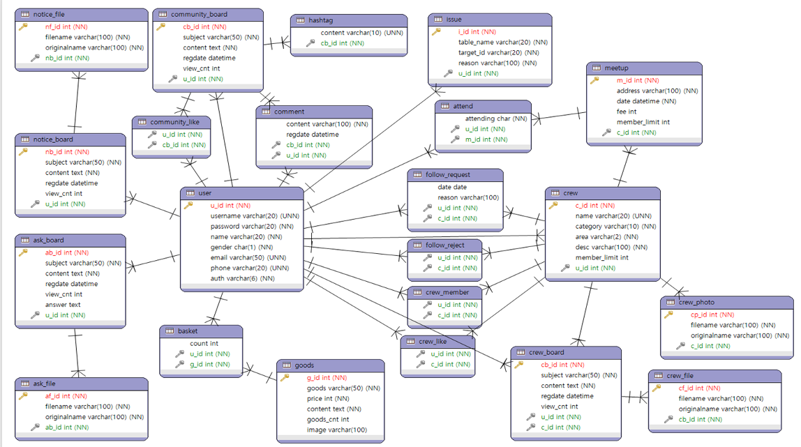

 # 땀땀(Spring Web Project)


###목차


## 개발 과정


### 개발 배경

공부 중인 Spring Framework를 이용해 운동을 중심으로 한 모임과 미팅의 관리가 유용한 커뮤니티를 만들고자 했습니다.

### 개발 기간

```
 * 2021년 12월 8일(수) ~ 2022년 1월 2일(일) [총 26일]
 * 프로젝트 기획 7일 / 구현 19일
```

### 사용 기술

```
HTML5, CSS3, JavaScript, jQuery, JSON, Ajax, BootStrap4.0, Java, Spring4, Spring Tool Suite(STS4), Spring Security, JSTL, EL, JPA, Apache Tomcat9.0, lombok
```

### 템플릿
뷰단은 themewagon이 제공하는 Enlight 템플릿을 기반으로 개발했습니다. 

https://themewagon.com/themes/free-education-website-template-enlight/

### 기능 구현 목표
    1. 회원가입/로그인(Spring Security)
    2. 관리자 페이지(게시물 수, 회원 수, 회원 탈퇴)
    3. 마이페이지
    2. 커뮤니티 게시판(CRUD, 사진공유, 댓글, 해시태그)
    3. 운동 크루 모집 페이지(CRUD, 좋아요, 크루 지원 관리, 크루 멤버 관리)
    4. 다가오는 미팅 페이지(CRUD, 참여/불참)
    5. 공지사항/문의페이지
    6. 홈페이지 로고 및 디자인
    
### DB 설계
* ERD

    
    
## 개발 결과

### 구현한 기능
    1. 회원가입/로그인
    2. 커뮤니티 게시판(CURD, 사진업로드, 댓글)
    3. 운동 크루 모집 페이지(CRUD, 좋아요, 크루 지원 관리, 크루 멤버 관리)
    4. 다가오는 미팅 페이지(CURD, 참여/불참)
    5. 공지사항/문의페이지
    6. 홈페이지 로고 및 디자인, 홈페이지 아이콘 제작
    
### 실제 서비스 모습

실제 서비스 사진

## Built With

   * anddudwls(팀장) : 전제적인 프로젝트 일정관리, 로그인, 로그아웃 페이지 구현  
   * unknown941 : 커뮤니티 게시판 CRUD 구현, 좋아요 및 댓글 기능 
   * solpinetree : 프로젝트 및 Github 세팅 및 관리, 크루 등록 구현, 모임 등록 구현, 크루 팔로우 요청  승인, 거절과 멤버의 크루 탈퇴에 대한 실시간 알림 구현, 오픈 채팅 구현, 크루장의 멤버 관리 모달과 팔로우 요청 관리 모달 구현 
   * lje1343 : 문의사항(CRUD, 파일업로드, 관리자답변) 공지사항(CRUD, 파일업로드) 
   * Eden0318 : 메인 페이지 및 크루 모집 페이지 구현 

 
 
 
 
 
 
 
 
 
 
 
 
 
 
 
 
 
 
 
 
 
 
 
 
 
 
 
 
 
 
 
 
 
 
 
 
 
